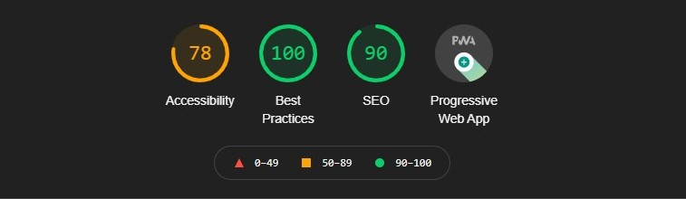

<div align="center"><h1>Chirp</h1></div>
<div align="center"><h3> Say hi to Chirp !</h3></div>
<div align="center"></div>


<pre><div align="center">       </div></pre> 

# Table of Content:

- [Demo](#demo)
- [Running the project](#running-the-project)
- [Creating a dialogflow agent](#creating-a-dialogflow-agent)
- [Stack in use](#stack-in-use)
- [PWA support](#pwa-support)
- [Lighthouse score](#lighthouse-score)
- [Testing](#testing)
- [Conversational Design](#conversational-design)
- [Evaluating Chirp](#evaluating-chirp)
- [Future scope](#future-scope)
- [Demo video](#demo-video)
- [Member List](#member-list)

## Demo
Don't wanna go through the trouble of cloning and running the project? That's fine! You can meet Chirp at the following link 
```
https://sunflower-xoih.web.app/#/
```


## Running the project
- Clone the project
- Open the project is VS code (or your favorite editor)
- Locate the VS Code status bar (the blue bar at the bottom of the window):
- Select a device from the Device Selector area
- Invoke Run > Start Debugging or press f5
- Wait for the app to launch — progress is printed in the Debug Console view.


## Creating a dialogflow agent
- Create a dialogflow agent by following these steps from google dialogflow documents
```
https://cloud.google.com/dialogflow/es/docs/quick/build-agent
```
- Add your agents json file to pubspec.yaml file as an asset
- Replace the dummy text in lib/pages/ChatBotPage.dart  with your agents json file
```
AuthGoogle authGoogle =
        await AuthGoogle(fileJson: "Enter path to your json file")
            .build();
```

## Stack in use
- Fontend : Frontend is setup using flutter and programmed in a way that it can be ran on desktop , web and android/ios !
- Dialogflow : All the intents and conversations are initiated from a dialogflow agent.
- Design : UI design was prototyped on Figma and conversational design on Miro 


## PWA support
Progressive Web Apps (PWA) are built and enhanced with modern APIs to deliver enhanced capabilities, reliability, and installability while reaching anyone, anywhere, on any device with a single codebase. Our application is PWA ready for your device !


## Lighthouse score
Not to flex but here's the Lighthouse score for our website
<div align="center"></div>


## Testing
- We conducted tests with random users to iteratively build Chirp to be a better application
- Testing was conducted on zoom/discord and users were asked to share there screen or camera if they are comfortable so as to note any visible confusion/dislike about something 
- Testing document can be found at
```
https://a-s-k-studio.gitbook.io/chirp/
```
- We are also building unit tests , integrated tests and widget tests for flutter code itself which will make the codebase more robust in future iterations


## Conversational Design
- Following Google's guide on conversational design we designed our conversation even before implementing the bot itself 
- The Guide can be found at the following link
```
https://developers.google.com/assistant/conversation-design/welcome
```
## Evaluating Chirp

#### Net Promoter Score (NPS)
- Promoters : 60%
- Neutral : 20%
- Detractors: 20%
- Based on feedbacks from these tests we updated Chirp to have a profile picture , multiple texts animation, better contexual dialog , fixing some broken intents and much more !

#### Conversation Interactions


## Future scope
- Adding intents with fulfillments to send requests to a server to make responses dynamic
- Expanding topics targeted during conversations to cover all of topics and subtopics that come under Sex and relationship education
- Login/signup to provide user based features
- Feature to pick up a conversation from a particular point


## Demo video
```
https://youtu.be/tVI9dI5G1x0
```

## Member List
```
Kenny : kennyjiahuacheng@gmail.com
```
```
Simi : simiwei2017@gmail.com
```
```
Ash: avichare@sfu.ca
```
